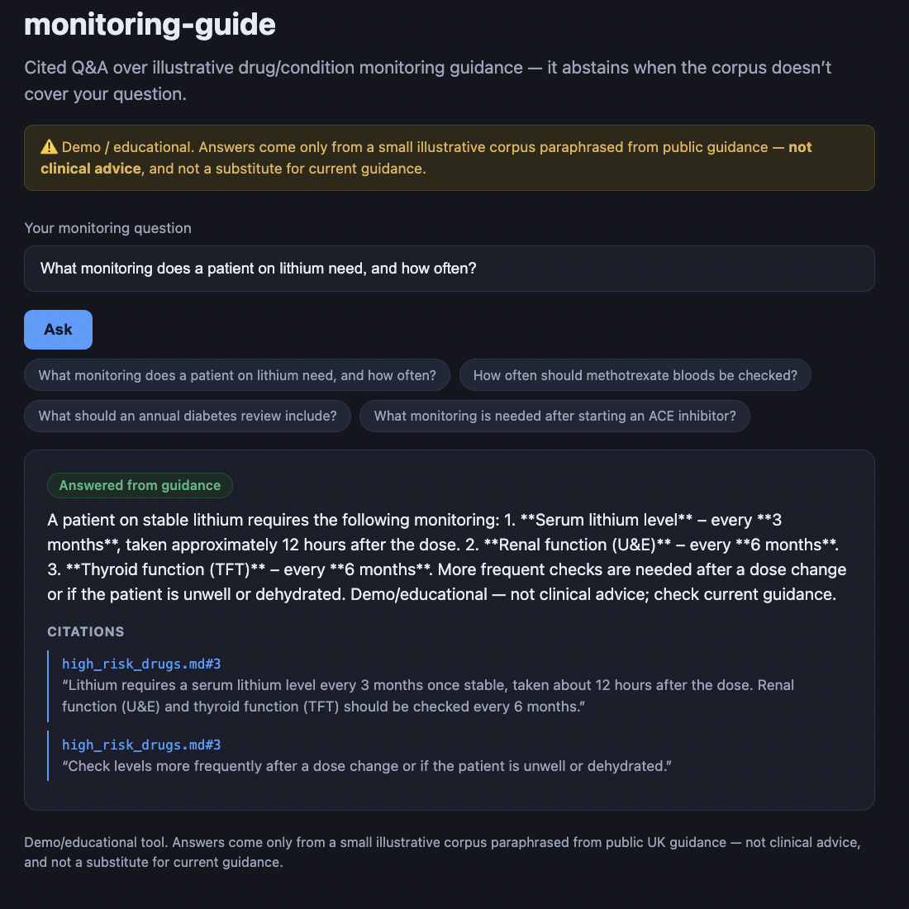

# monitoring-guide

### ▶ Live demo: **[monitoring-guide.kareemghazal.com](https://monitoring-guide.kareemghazal.com)**

Ask a monitoring question and get a cited answer — or an honest "not covered" when the corpus
doesn't have it. (First run ~10–20s.)



> **Demo / educational — not clinical advice.** Answers come only from a small illustrative corpus
> paraphrased from public UK guidance (BNF / NICE CKS style). Not a substitute for current guidance.

Grounded, cited **Q&A over drug/condition monitoring guidance** — and it **abstains** when the
question isn't covered by the corpus. A retrieval-augmented (RAG) system built the way a
safety-critical one should be: it answers only from retrieved sources, cites them, and refuses
rather than guessing.

The design rule (shared across these tools): **answer only from the retrieved context, cite it, and
say "not covered" otherwise** — enforced three ways: the prompt says it, the `Answer` schema requires
citations + an explicit `abstained` flag, and the evals check it (is every citation quote really in
its chunk? are out-of-corpus questions refused?). In a clinical setting, a confident wrong answer is
worse than an honest "I don't know."

## Architecture

```
question ─▶ Voyage embed ─▶ cosine search over the guidance corpus ─▶ top-k chunks
                                                                          │
                                                                          ▼
                                                     grounded, cited Answer (or abstain)
```

Generic RAG modules (`embedder`, `store`, `chunking`, `ingest`, `client`) are the same building
blocks as [rag-doc-qa](https://github.com/kgtceo/rag-doc-qa), retargeted to a bundled clinical corpus.

## Quickstart

```bash
pip install -e .
cp .env.example .env   # add ANTHROPIC_API_KEY + VOYAGE_API_KEY

monitoring-guide ask "What monitoring does a patient on lithium need?"
```

## Evals

```bash
python evals/run_evals.py             # retrieval / abstention / grounding + an opus judge
python evals/run_evals.py --no-judge  # skip the judge
```

- **Retrieval** — the expected source doc is retrieved for in-corpus questions.
- **Abstention** — out-of-corpus questions (e.g. "what antibiotic for a chest infection?") are refused.
- **Grounding** — every citation quote actually appears in its cited chunk (deterministic).
- **Judge** — opus confirms faithfulness + appropriate abstention.

**Latest run (claude-sonnet-4-6, voyage-3 embeddings):** all gates pass — the in-scope ACE-inhibitor monitoring question is answered and grounded, while out-of-scope questions ("insulin dose?", "what antibiotic for a chest infection?") are correctly refused.

## Tests

```bash
pytest -q   # offline: chunking, retrieval plumbing, grounded-answer path (fake embedder + client)
```

## Web

`web/` — a Next.js UI: ask a question, get a cited answer or an honest abstention, safety banner
throughout.

Run it locally in two terminals:

```bash
# terminal 1 — the API
pip install -e .
cp .env.example .env                  # add ANTHROPIC_API_KEY and VOYAGE_API_KEY
python -m uvicorn monitoring_guide.api:app --port 8000

# terminal 2 — the UI
cd web
npm install
echo "NEXT_PUBLIC_API_URL=http://localhost:8000" > .env.local
npm run dev                           # open http://localhost:3000
```

See [DEPLOY.md](./DEPLOY.md).

## License

MIT — see [LICENSE](./LICENSE).
