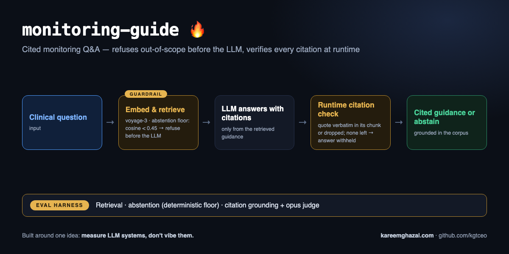

# monitoring-guide

### ▶ Live demo: **[monitoring-guide.kareemghazal.com](https://monitoring-guide.kareemghazal.com)**

Ask a monitoring question and get a cited answer — or an honest "not covered" when the corpus
doesn't have it. (First run ~10–20s.)


**How it works** — input → pipeline → output, with the eval harness that measures it:



> **Demo / educational — not clinical advice.** Answers come only from a small illustrative corpus
> paraphrased from public UK guidance (BNF / NICE CKS style). Not a substitute for current guidance.

Grounded, cited **Q&A over drug/condition monitoring guidance** — and it **abstains** when the
question isn't covered by the corpus. A retrieval-augmented (RAG) system built the way a
safety-critical one should be: it answers only from retrieved sources, cites them, and refuses
rather than guessing.

The design rule (shared across these tools): **answer only from the retrieved context, cite it, and
say "not covered" otherwise** — enforced four ways, two of them AT RUNTIME:

1. **A deterministic abstention floor.** If the best retrieval cosine is below a measured
   threshold (0.45 — in-corpus questions top ~0.64–0.77, out-of-corpus ~0.20–0.38 with voyage-3),
   the question is refused **before the LLM is ever called**. Out-of-scope refusal does not
   depend on model judgment.
2. **Runtime citation verification.** Every citation's quote must be a verbatim substring of the
   chunk it cites, and the chunk must be one that was actually retrieved. Failing citations are
   dropped (and surfaced on the result), and an answered response whose citations ALL fail is
   **withheld and forced to abstain** — an uncited answer is worse than no answer.
3. The prompt and the `Answer` schema require citations + an explicit `abstained` flag.
4. The evals re-check all of it independently, plus an opus judge.

In a clinical setting, a confident wrong answer is worse than an honest "I don't know."

## Architecture

```
question ─▶ Voyage embed ─▶ cosine search over the guidance corpus ─▶ top-k chunks
                                                                          │
                                                                          ▼
                                                     grounded, cited Answer (or abstain)
```

Generic RAG modules (`embedder`, `store`, `chunking`, `ingest`, `client`) are the same building
blocks as [rag-doc-qa](https://github.com/kgtceo/rag-doc-qa), retargeted to a bundled clinical corpus.

## Quickstart

```bash
pip install -e .
cp .env.example .env   # add ANTHROPIC_API_KEY + VOYAGE_API_KEY

monitoring-guide ask "What monitoring does a patient on lithium need?"
```

## Evals

```bash
python evals/run_evals.py             # retrieval / abstention / grounding + an opus judge
python evals/run_evals.py --no-judge  # skip the judge
```

- **Retrieval** — the expected source doc is retrieved for in-corpus questions.
- **Abstention** — out-of-corpus questions (e.g. "what antibiotic for a chest infection?") are refused.
- **Grounding** — every citation quote actually appears in its cited chunk (deterministic).
- **Judge** — opus confirms faithfulness + appropriate abstention.

Every run writes a **reproducible artifact** to [`evals/results/latest.json`](evals/results/latest.json)
— per-case outcomes (including each question's top retrieval score and whether the floor refused
it), metrics, models, timestamp. The numbers below come from that file.

**Latest run (claude-sonnet-4-6, voyage-3 embeddings, opus judge):** all **10 cases** pass with
judge overall **5.0/5** — 5 in-scope questions answered and verbatim-grounded (including the
baseline-monitoring question: TPMT before azathioprine), and all 5 out-of-scope cases refused
**by the deterministic retrieval floor before the LLM was called**: an insulin-dosing question
(top score 0.185), an antibiotic-choice question (0.353), a general-knowledge question (0.196), a
**jailbreak attempt** ("ignore your instructions…", 0.381), and a **near-miss personal-advice
question** ("should I stop my lithium?", 0.429 — lithium is in scope, but the question asks for
advice, and it lands just under the 0.45 floor).

## Tests

```bash
pytest -q   # offline: chunking, retrieval plumbing, grounded-answer path (fake embedder + client)
```

## Web

`web/` — a Next.js UI: ask a question, get a cited answer or an honest abstention, safety banner
throughout.

Run it locally in two terminals:

```bash
# terminal 1 — the API
pip install -e .
cp .env.example .env                  # add ANTHROPIC_API_KEY and VOYAGE_API_KEY
python -m uvicorn monitoring_guide.api:app --port 8000

# terminal 2 — the UI
cd web
npm install
echo "NEXT_PUBLIC_API_URL=http://localhost:8000" > .env.local
npm run dev                           # open http://localhost:3000
```

See [DEPLOY.md](./DEPLOY.md).

## License

MIT — see [LICENSE](./LICENSE).
